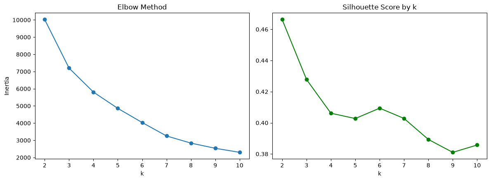
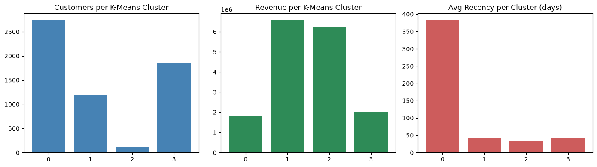
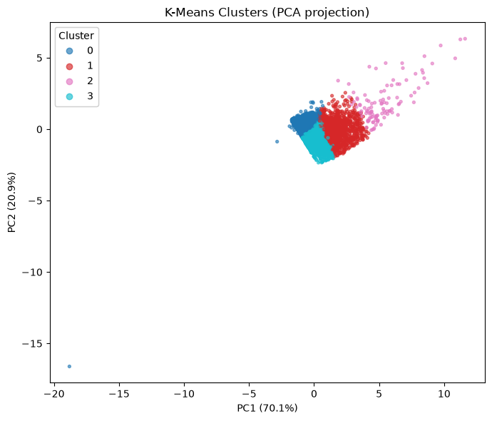
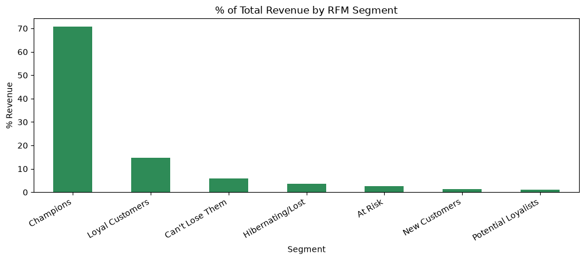
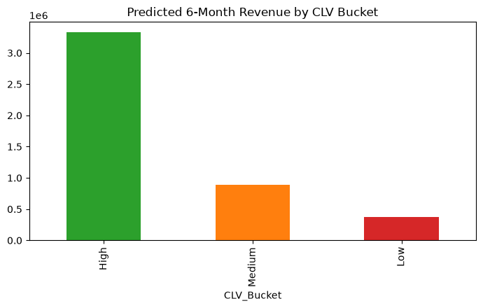

# Online Retail II: Customer Segmentation, CLV Prediction & Recommendation System

Predictive customer analytics on the [Online Retail II](https://archive.ics.uci.edu/dataset/502/online+retail+ii) dataset (UCI/Kaggle): RFM segmentation, K-Means + DBSCAN clustering, CLV prediction with BG/NBD + Gamma-Gamma, and a hybrid recommendation system combining collaborative and content-based filtering.

Stack: `pandas`, `numpy`, `scikit-learn`, `lifetimes`, `matplotlib`.

## Data cleaning

Starting from the raw dataset (1,067,371 rows, 8 columns), I removed:
- Rows with `Price <= 0` (6,207 rows): junk/write-off entries such as `damages`, `check`, `found`, `?`, `thrown away`, not real sales.
- The internal test SKUs `TEST001` / `TEST002` (17 rows), literally labelled "THIS IS A TEST PRODUCT."

I kept shipping/fee/admin codes (`POST`, `DOT`, `M`, `D`, `S`, `C2`, `BANK CHARGES`, `ADJUST`, `ADJUST2`, `AMAZONFEE`, `PADS`, `CRUK`) and gift voucher codes, since these are real revenue customers actually paid. Cancellations (invoice numbers starting with `C`) are also kept rather than dropped; they're flagged with an `IsCancellation` column and net out naturally wherever revenue or customer value gets calculated, since a cancellation carries a negative amount.

| Metric | Before | After |
|---|---|---|
| Total rows | 1,055,336 | 1,061,150 |
| Customer-level rows | 820,579 | 824,279 |
| Unique customers | 5,875 | 5,939 |
| Total revenue (ex-cancellations) | £17.43M | £20.97M |

## EDA

- Total revenue (excluding cancellations): **£20,972,368.57** across 40,067 orders and 5,878 customers. Average order value: £523.43.
- The UK accounts for 85.2% of revenue; EIRE, Netherlands, Germany and France follow at 1.7% to 3.2% each.
- Best month: November 2011 (£1.51M). Worst: February 2011 (£523.6K). Best day of week: Thursday (£4.3M total); Saturday is effectively closed (£9.8K).
- **72.4%** of customers are repeat buyers. The top 10% of customers generate **63.9%** of revenue, and the top 20% generate **77.2%**, a strong Pareto pattern that motivates the segmentation and CLV work below.

## RFM segmentation

For every customer I calculated Recency (days since last real purchase), Frequency (distinct non-cancelled orders) and Monetary (net revenue, sales minus cancellations). Using net rather than gross Monetary matters: it automatically resolves outlier cases like customer 12346, an internal test account that placed one huge order and cancelled it the same day, without needing a manual exclusion rule.

Scoring each dimension into quintiles and mapping customers into 7 standard segments:

| Segment | Customers | % of customers | % of revenue |
|---|---|---|---|
| Champions | 1,474 | 25.1% | 70.7% |
| Loyal Customers | 1,228 | 20.9% | 14.7% |
| Can't Lose Them | 354 | 6.0% | 5.8% |
| Hibernating / Lost | 1,526 | 26.0% | 3.6% |
| At Risk | 471 | 8.0% | 2.7% |
| New Customers | 440 | 7.5% | 1.3% |
| Potential Loyalists | 385 | 6.5% | 1.2% |

Champions alone, a quarter of the customer base, bring in over two-thirds of all revenue.

## Clustering

A second, independent view on top of the same (log-transformed, standardized) RFM features.

**K-Means**: tested k=2 through k=10 with the elbow method and silhouette score. k=2 had the best silhouette (0.466) but is too coarse to act on; I went with **k=4** instead (silhouette 0.406, close to the best, and the elbow curve clearly flattens there).

| Cluster | Customers | % of customers | % of revenue | Avg. recency (days) |
|---|---|---|---|---|
| VIP | 109 | 1.9% | 37.5% | 32.1 |
| High value | 1,179 | 20.1% | 39.3% | 42.9 |
| Regular | 1,848 | 31.4% | 12.2% | 42.8 |
| Inactive | 2,742 | 46.6% | 11.0% | 383.0 |

**DBSCAN**: a density-based second opinion, mainly useful here for flagging outliers. With `eps` picked from the k-distance graph and `min_samples=6`, it found 13 small clusters plus 411 customers flagged as outliers (7.0%). Their average net Monetary value is £21,398, far above a typical customer, meaning DBSCAN independently converged on the same high-value group K-Means separated out, a good sign the segmentation reflects something real rather than an artifact of one algorithm.






## Customer Lifetime Value (CLV)

Two models used together: **BG/NBD** predicts how many more purchases a customer will make; **Gamma-Gamma** predicts their average spend per order (this requires spend to be uncorrelated with frequency; the actual correlation was 0.021, close enough to zero). Multiplying the two gives a predicted 6-month CLV per customer. One-time buyers (27.6% of customers) don't have enough repeat-purchase history for Gamma-Gamma, so they fall back to the overall average order value.

**A bug I found and fixed**: some invoices are placed and then fully cancelled by a same-day, same-amount reversal. Before I caught this, the CLV model treated these as real purchases, one customer had an 80,995-unit order worth £168,469.60 that was cancelled the same day (true net spend: £2.90), and their predicted CLV came out as the single highest in the dataset purely from this artifact. I fixed it by matching every sale invoice against that customer's cancellations at the invoice level and excluding any invoice fully offset by a matching reversal, before fitting the models. This removed 562 fake invoices dataset-wide.

**Validation**: split into a calibration period (first 75% of the timeline) and holdout (last 25%), fit on calibration only, checked against holdout. Predicted holdout purchases were within about 1.7% of actual, with a 0.85 correlation between predicted and actual purchases per customer.

| CLV bucket | Customers | Total predicted 6-month revenue |
|---|---|---|
| High | 1,170 | £3,329,027 |
| Medium | 1,754 | £885,714 |
| Low | 2,923 | £376,874 |



## Recommendation system

Both collaborative and content-based filtering, combined into a hybrid.

- **Collaborative filtering**: a customer by product matrix (5,852 customers x 4,620 products, ~1.78% filled), from which item-to-item similarity is computed and used to recommend products similar to what a customer has already bought.
- **Content-based filtering**: after cleaning up the product catalog (standardizing codes, picking the most common description per product), TF-IDF similarity on product descriptions finds products similar in wording. As a sanity check, the closest matches to "White Hanging Heart T-Light Holder" were all other heart or T-light-holder variants.
- **Hybrid**: the two scores combined 50/50. On sample customers, someone with skull-themed purchases got skull-themed napkins, plates and wall stickers recommended; someone who bought fairy-cake products got other fairy-cake case variants, both consistent with what you'd expect.

## Limitations / things I'd revisit

- The CLV time horizon (6 months) and the High/Medium/Low bucketing (top 20% / next 30% / bottom 50%) were both my own choices rather than a specified business rule; both would need to be validated against an actual business objective.
- The 50/50 hybrid recommendation weighting hasn't been tuned or tested against held-out purchases.
- Data quality issues found but not corrected at the source: 621 product codes with inconsistent description text (e.g. "DOILEY" vs "DOILY"), 170 product codes duplicated across letter case (e.g. `15056bl` vs `15056BL`), 12 customers linked to more than one country, and `Unspecified`/`European Community` inflating the country count without being real countries.
- No behavioral/clickstream data exists in this dataset (only purchase transactions), so anything like browsing or session activity isn't modeled.

## Repository structure

```
├── Online_Retail_II_Analysis.ipynb   # full pipeline: cleaning -> EDA -> RFM -> clustering -> CLV -> recommendations -> export
├── charts/                           # figures referenced above
├── data/                             # exported deliverable tables (gitignored: raw data)
└── requirements.txt
```

## How to run

```bash
python -m venv .venv && source .venv/bin/activate
pip install -r requirements.txt
jupyter nbconvert --to notebook --execute --inplace Online_Retail_II_Analysis.ipynb
```

The notebook checks for the raw CSV in a Kaggle input path, then tries a `kagglehub` download, then falls back to a local `online_retail_II.csv` in the working directory.

## Data

Online Retail II, UCI Machine Learning Repository / Kaggle (`mashlyn/online-retail-ii-uci`).
